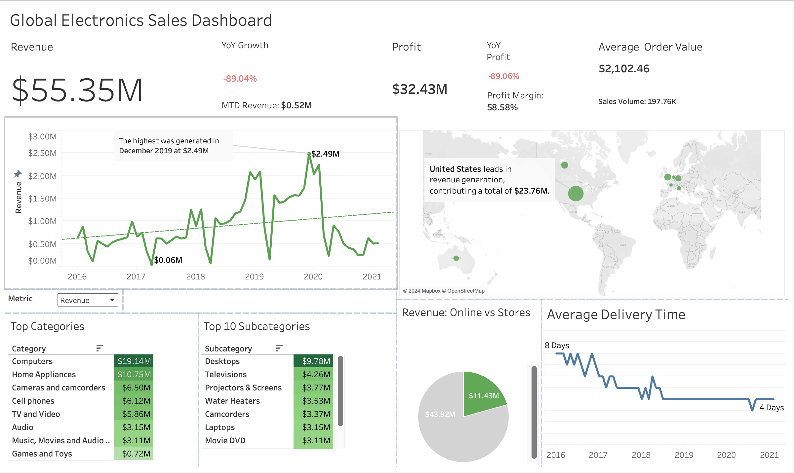

# Global Electronics Sales Analysis

## Project Overview
This project analyzes global sales data for an electronics company to provide actionable business insights. Using SQL for data cleaning and analysis, and Tableau for visualizations, the project uncovers revenue trends, product performance, and regional profitability.

## Objectives
- Identify top-performing product categories and regions.
- Analyze seasonal patterns and trends.
- Measure key performance indicators (KPIs) like revenue, profit, YoY growth, and AOV.
- Compare online vs. in-store sales performance.

## Tools and Technologies
- **PostgreSQL**: For data cleaning, transformation, and analysis.
- **Tableau**: For interactive visualizations.
- **Git**: For version control.

## File Structure
- `data/`: Raw and processed datasets.
- `sql/`: SQL scripts for data cleaning and analysis.
- `visualizations/`: Tableau workbooks and dashboard screenshots.
- `docs/`: Project documentation and ER diagrams.

## Key Insights
1. **Revenue Trends**: Peak revenue in December 2019, with seasonal patterns visible.
2. **Product Performance**: Computers generate the most revenue ($19.14M), with Desktops leading subcategories.
3. **Regional Profitability**: Australia has the highest AOV ($3,246), warranting further investigation.
4. **Delivery Efficiency**: Average delivery time has reduced from 8 days to 4 days.

## Dashboard




## Setup and Usage
1. Clone the repository:
   ```bash
   git clone https://github.com/your-username/global-electronics-sales.git
